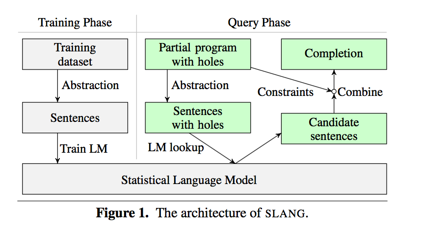
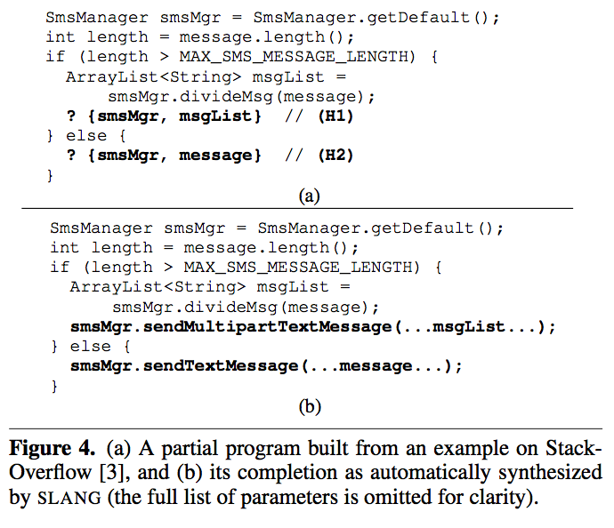

# Code Completion with Statistical Language Models

该论文利用API 进行代码合成。训练出的模型可以根据代码片段的上下文进行API调用（包含方法调用的参数）的补充。

## Contribution

- 提出了一种新的利用API进行代码补全的方法，本文将代码补全问题归纳为自然语言处理中预测句子概率的问题
- 通过在大量的代码集合中提取方法调用序列，并利用统计语言模型（N-gram/RNN）学习来进行静态分析
- 在程序合成过程中，带有holes的部分代码片段作为输入，根据语言模型对代码的概率预测来进行代码补全。在补全时可以跨越多个对象以及包括API参数的补全
- 本文根据提出的方法实例化了一个代码补全的工具 _SLANG_, 实验表明 _SLANG_ 效率正确率都很高

## Overview

## Synthesis process

1. 计算holes的抽象历史
  $$ \mathbf{smsMgr} \mapsto \left \{ \left \langle getDefault, ret \right \rangle \cdot \left \langle \mathbf{H_{2}} \right \rangle, \left \langle getDefault, ret \right \rangle\cdot \left \langle divideMsg, 0 \right \rangle\cdot \left \langle \mathbf{H_{1}} \right \rangle \right \} $$
